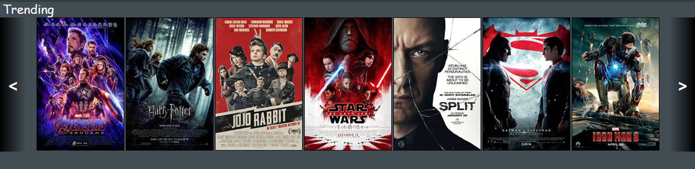

# Custom Carousel

## A carousel with multiple elements at once.



# Usage:

```
<h1 class="CustomCarousel-header">
      Header
    </h1>
    <div class="CustomCarousel" data-padding="3">
      <div class="CustomCarousel-inner"></div>
      <button class="btn-prev"><</button>
      <button class="btn-next">></button>
</div>
```

## Optional:

data-padding= 'X'.
<br>
Adds padding between the items.
<br>
<br>

# Columns Version:

adding "Columns" - gives you the ability to decide how many items will show per screen ratio.

```
<div class="CustomCarousel"  data-items="2,4,5,6,8">
...
</div>
```

<p>
<h3><b>just add:</b> data-items= 'X, X, X, X, X'. (replace with numbers)
</h3>

\*The screen ratios are identicale to the bootsrtap ones:


</p>

# Extras:


The extras.css is used to create an hover affect.
<br>
it should be used with "CustomCarousel-footer":

```
<h1 class="CustomCarousel-header">
     ...
</h1>
<div class="CustomCarousel">
     <div class="CustomCarousel-inner">
          ...
     </div>
     <button class="btn-prev"><</button>
     <button class="btn-next">></button>
</div>
<div class="CustomCarousel-footer"></div>
```
